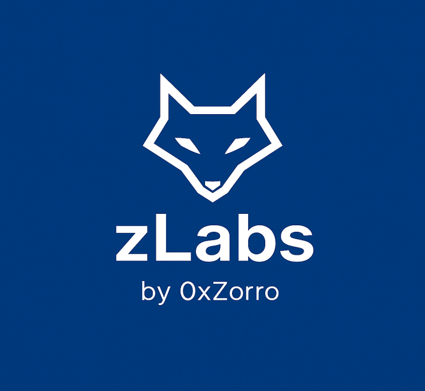

  

# 👋 Welcome

I'm a **State-certified Technical Engineer in Automation and Process Control**.  
Currently, my focus is on **cybersecurity**, **C++**, and **Python**, with a strong interest in technical software development and system-oriented thinking.

This space serves as a place to document my personal projects, tools, and experiments based on my current areas of interest.

---

## Technologies & Focus Areas

- **Programming Languages**: C++, Python, Structured Text (IEC 61131-3)  
- **Topics**:  
  - Cybersecurity & secure software practices  
  - System-level tools & protocol fundamentals  
  - Technical background in automation (Siemens TIA Portal & Beckhoff TwinCAT)

---

## Current Projects & Learning Goals

- Developing small tools and scripts in Python & C++  
- Working with Linux & CLI-based security environments  
- Hands-on learning via platforms like TryHackMe and Hack The Box

---

## Purpose of this Repository

This profile is a personal collection of technical work,  
mostly related to **programming**, **security exploration**, and **low-level experimentation**.
